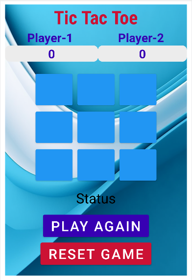
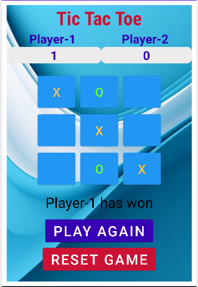
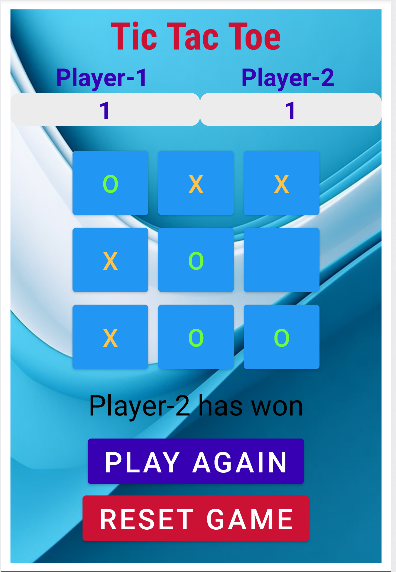
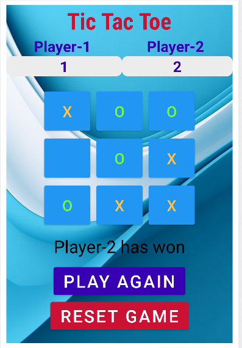

# TicTacToeGame

## Android Tic Tac Toe oyunu

Tic Tac Toe, iki oyuncunun sırayla X ve O işaretlerini 3x3'lük bir kare üzerine yerleştirdiği klasik bir oyundur. Üç adet X veya O'nun yatay, dikey veya çapraz olarak sıralandığı oyunda, bu işlemi başaran oyuncu oyunu kazanır.

## Özellikler

- Oynanabilir arayüz, oyun için butonlar
- Oyuncu 1 ve oyuncu 2 için puan takibi
- Tekrar oyna ve oyunu sıfırla seçenekleri

## Ekran Görüntüleri

### Oynanış Ekran Görüntüsü 1

### Oynanış Ekran Görüntüsü 2

### Oynanış Ekran Görüntüsü 3

### Oynanış Ekran Görüntüsü 4

